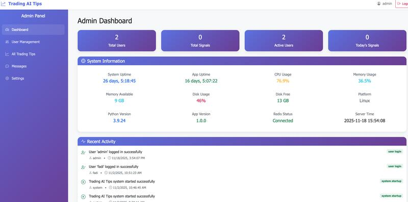
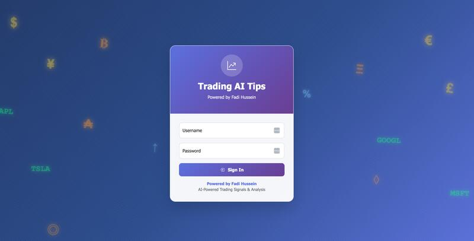
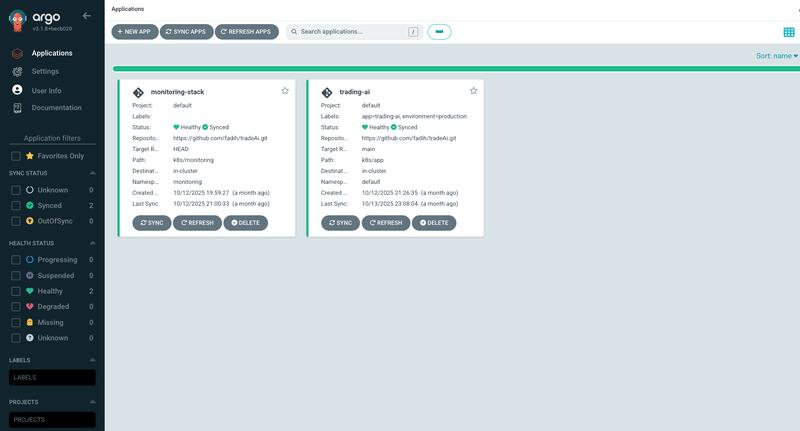

# Trading AI - AI-Powered Trading Intelligence Platform

An intelligent trading system that combines AI sentiment analysis, technical indicators, and real-time market data to help you make better trading decisions.

> **Important:** This is an informational tool only. Always paper trade first and never risk more than you can afford to lose.

---

## What This Platform Does

Trading AI analyzes market data from multiple sources, combines technical analysis with AI-powered sentiment analysis, and generates trading signals to help you stay informed about potential trading opportunities.

### Key Features

- **AI Sentiment Analysis** - Uses FinBERT to analyze market news and social media sentiment
- **Technical Indicators** - RSI, MACD, EMA, ATR for comprehensive market analysis
- **Web Dashboard** - Beautiful interface to monitor signals and market data
- **Smart Notifications** - Get alerts via Telegram, Slack, or console
- **Backtesting** - Test your strategies on historical data
- **Auto-Tuning** - Automatically optimizes parameters for better performance
- **Cloud Ready** - Deploy on Kubernetes with monitoring and backups

---

## Platform Overview

### Main User Interface


The main dashboard provides real-time monitoring of trading signals, market data, and system status.

### Signal Generation


Generate and analyze trading signals with detailed technical and sentiment insights.

### Admin Panel



Manage system configuration, monitor performance, and adjust trading parameters.

### Login Screen



Secure authentication for accessing the trading platform.

### Telegram Bot Integration


Receive trading alerts and signals directly in Telegram.

### Grafana Monitoring


Comprehensive monitoring and analytics with Grafana dashboards.

### ArgoCD Deployment



Automated deployments using GitOps with ArgoCD.

---

## Quick Start

### Option 1: Using Docker (Easiest)

```bash
# Clone the repository
git clone https://github.com/Fadih/tradeAi.git
cd tradeAi

# Start everything with Docker Compose
docker-compose up -d

# The web interface will be available at http://localhost:8000
```

### Option 2: Local Development

```bash
# Clone the repository
git clone https://github.com/Fadih/tradeAi.git
cd tradeAi

# Create virtual environment
python3 -m venv .venv
source .venv/bin/activate  # On macOS/Linux
# .venv\Scripts\activate   # On Windows

# Install dependencies
pip install -r requirements.txt

# Run the web interface
python start_web.py

# Open http://localhost:8000 in your browser
```

### Option 3: Using Makefile

```bash
# Setup development environment
make setup-dev
source .venv/bin/activate

# Install dependencies
make install

# Run web interface
make web-run
```

---

## Basic Configuration

Create a `.env` file in the project root with your settings:

```bash
# Trading symbols to monitor
AGENT_TICKERS="BTC/USDT,ETH/USDT,SPY"

# Timeframe (1m, 5m, 15m, 30m, 1h, 4h, 1d)
AGENT_TIMEFRAME="1h"

# Notification method (console, telegram, slack)
AGENT_NOTIFIER="console"

# Optional: Telegram notifications
TELEGRAM_BOT_TOKEN="your_bot_token"
TELEGRAM_CHAT_ID="your_chat_id"

# Optional: Hugging Face token for AI sentiment analysis
HF_TOKEN="your_hf_token"
```

For more configuration options, see the [Configuration Examples](#configuration-examples) section below.

---

## Using the Platform

### Web Interface

1. **Start the web interface:**
   ```bash
   python start_web.py
   ```

2. **Access the dashboard:**
   - Open your browser to `http://localhost:8000`
   - View real-time trading signals
   - Generate new signals
   - Monitor market data

### Command Line Interface

```bash
# Show current configuration
python -m agent.cli show-config

# Get a quick trading tip
python -m agent.cli tip

# Run one-time analysis
python -m agent.cli run-once

# Backtest your strategy
python -m agent.cli backtest --bars 500

# Auto-tune parameters
python -m agent.cli tune --bars 500

# Schedule regular analysis (every 15 minutes)
python -m agent.cli schedule
```

---

## Platform Features in Detail

### 1. AI-Powered Sentiment Analysis

The platform uses FinBERT (a financial language model) to analyze news articles and social media posts, providing sentiment scores that help gauge market mood.

### 2. Technical Analysis

Advanced technical indicators help identify trends and potential entry/exit points:
- **RSI** - Identifies overbought/oversold conditions
- **MACD** - Shows momentum and trend changes
- **EMA** - Smooth moving averages for trend identification
- **ATR** - Measures volatility for risk management

### 3. Signal Fusion

Combines technical analysis (60%) and sentiment analysis (40%) to generate more reliable trading signals.

### 4. Risk Management

- Automatic stop-loss calculations based on volatility
- Position sizing recommendations
- Regime filtering (bull/bear market awareness)

### 5. Backtesting

Test your strategies on historical data before risking real money:
- Sharpe ratio calculation
- Win rate analysis
- Maximum drawdown tracking

---

## Deployment Options

### Docker Deployment

```bash
# Build and run
docker-compose up -d

# View logs
docker-compose logs -f

# Stop
docker-compose down
```

### Kubernetes Deployment

The project includes complete Kubernetes manifests:
- Deployment configurations
- Service mesh setup (Istio)
- Monitoring with Prometheus and Grafana
- Automated backups
- GitOps with ArgoCD

See the `k8s/` directory for deployment configurations.

---

## Configuration Examples

### Basic Setup

```bash
export AGENT_TICKERS="BTC/USDT,ETH/USDT"
export AGENT_TIMEFRAME="1h"
export AGENT_NOTIFIER="console"
```

### With Telegram Notifications

```bash
export AGENT_TICKERS="BTC/USDT,ETH/USDT"
export AGENT_NOTIFIER="telegram"
export TELEGRAM_BOT_TOKEN="your_token"
export TELEGRAM_CHAT_ID="your_chat_id"
```

### With AI Sentiment Analysis

```bash
export HF_TOKEN="your_huggingface_token"
export HF_FIN_SENT_MODEL="ProsusAI/finbert"
```

### Advanced Configuration

For detailed configuration options, check the `config/` directory:
- `app.yaml` - Application settings
- `trading.yaml` - Trading parameters
- `logging.yaml` - Logging configuration

---

## Data Sources

The platform supports multiple data sources:

- **Crypto Markets** - 100+ exchanges via CCXT (Binance, Coinbase, etc.)
- **Stock Markets** - Equities and ETFs via Alpaca API
- **News Feeds** - RSS feeds for market news
- **Social Media** - Reddit posts for sentiment analysis

---

## Notifications

Receive alerts through:
- **Console** - See signals in terminal
- **Telegram** - Get instant messages with trading signals
- **Slack** - Team notifications via webhook

---

## Additional Resources

- Check `docs/` for detailed API documentation
- See `k8s/` for Kubernetes deployment guides
- Review `CHANGELOG.md` for version history

---

## Development

### Project Structure

```
tradeAi/
├── agent/           # Core trading logic
├── web/             # Web interface and API
├── config/          # Configuration files
├── k8s/             # Kubernetes deployments
└── docs/            # Documentation
```

### Available Make Commands

```bash
make help          # Show all commands
make install       # Install dependencies
make setup-dev     # Setup development environment
make web-run       # Run web interface
make docker-build  # Build Docker image
make docker-run    # Run Docker container
```

---

## Important Disclaimers

- **This is not financial advice** - Always do your own research
- **Paper trade first** - Test strategies before using real money
- **Risk management** - Never risk more than you can afford to lose
- **Market volatility** - Cryptocurrency and stock markets are highly volatile

---

## Contributing

Contributions are welcome! Please feel free to submit a Pull Request.

---

## Developer

**Developed by [Fadi Hussein](https://github.com/Fadih)**

Senior DevOps Engineer specializing in cloud infrastructure, AI/ML integration, and full-stack development.

**Connect:**
- **GitHub**: [Fadih](https://github.com/Fadih)
- **LinkedIn**: [Fadi Hussein](www.linkedin.com/in/fadi-hussein-8ab7403b)

---

## License

This project is provided as-is for educational and informational purposes.

---

**If this project helps you, please give it a star on GitHub!**

---

## Quick Links

- [API Documentation](http://localhost:8000/docs) (when running)
- [Grafana Dashboard](http://localhost:3000) (if deployed)
- [ArgoCD](http://localhost:8080) (if deployed)
- [Change Log](CHANGELOG.md)
